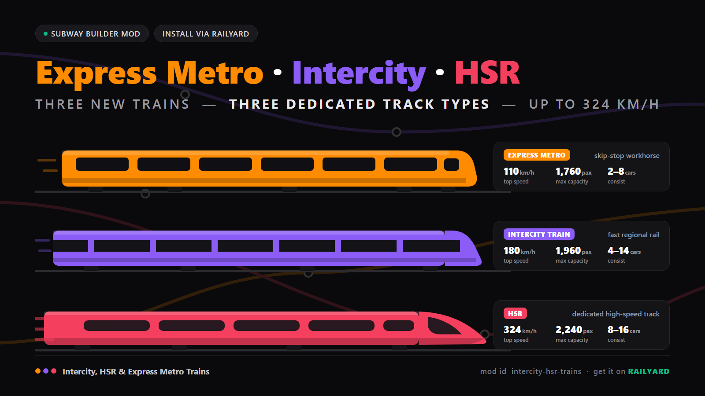
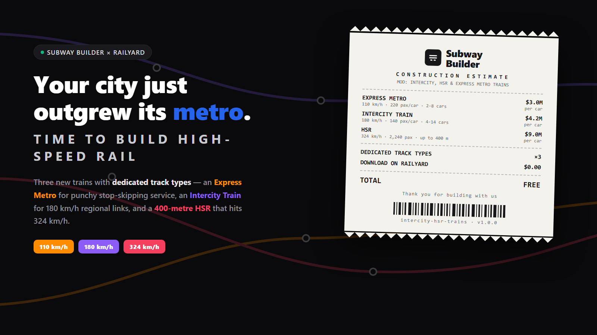

# Intercity, HSR & Express Metro Trains

A Subway Builder mod that adds three new trains, each with its own dedicated track type (different train types do not share tracks):

- **Express Metro** — a quick metro for express services: the strongest acceleration of the three and a top speed of ~110 km/h.
- **Intercity Train** — fast regional rail at 180 km/h with high seated capacity for city-to-suburb links.
- **HSR** — high-speed rail at 324 km/h on its own dedicated tracks, with the longest trains and the highest total capacity. Acceleration is the lowest of the three, but deliberately kept strong enough to stay playable on short station spacing.

## Install (via Railyard)

Install through the Railyard mod manager, or manually: drop the mod zip's files into a folder under your Subway Builder `mods/` directory (Windows: `%APPDATA%\metro-maker4\mods\`), restart the game, and enable the mod under Settings > Mods.

## Train stats

Game speed units are m/s; km/h shown for readability. Cost is in in-game currency. Platform lengths follow the game's formula (car length x car count + 4 m buffer).

### Express Metro

| Stat | Value |
| --- | --- |
| Top speed | 30.56 m/s (~110 km/h) |
| Acceleration / braking | 1.25 / 1.3 m/s² (strongest of the three) |
| Capacity | 220 per car; 2–8 cars (steps of 2) → up to 1,760 per train |
| Car length / train length | 20 m per car → 40–160 m trains |
| Platform length | 44–164 m |
| Cost | 3,000,000 per car; track 32,000/m; station 62,000,000 |
| Track | `express-metro` (dedicated); fully grade-separated like the metros |

### Intercity Train

| Stat | Value |
| --- | --- |
| Top speed | 50 m/s (180 km/h) |
| Acceleration / braking | 1.05 / 1.2 m/s² |
| Capacity | 140 per car; 4–14 cars (steps of 2) → up to 1,960 per train |
| Car length / train length | 25 m per car → 100–350 m trains |
| Platform length | 104–354 m |
| Cost | 4,200,000 per car; track 28,000/m; station 58,000,000 |
| Track | `intercity-train` (dedicated); no street running |

### HSR

| Stat | Value |
| --- | --- |
| Top speed | 90 m/s (324 km/h) |
| Acceleration / braking | 0.9 / 1.0 m/s² (lowest of the three, still brisk) |
| Capacity | 140 per car; 8 or 16 cars (8-car sets) → up to 2,240 per train |
| Car length / train length | 25 m per car → 200–400 m trains |
| Platform length | 204–404 m |
| Cost | 9,000,000 per car; track 45,000/m; station 80,000,000 |
| Track | `hsr` (dedicated, like Maglev-style track matching); no street running |

Speed order: Express Metro < Intercity Train < HSR. Capacity/length order: Express Metro < Intercity Train < HSR.

---

# 城际、高铁与快速地铁列车

本模组为 Subway Builder 新增三种列车，每种列车拥有自己专属的轨道类型（不同车型不共享轨道）：

- **快速地铁（Express Metro）** — 面向大站快车服务的地铁：三者中加速度最强，最高时速约 110 km/h。
- **城际列车（Intercity Train）** — 时速 180 km/h 的城际/市域快速铁路，坐席载客量高，适合市中心与郊区之间的联络线。
- **高铁（HSR）** — 时速 324 km/h 的高速铁路，使用专属轨道；编组最长、总载客量最高。加速度为三者中最低，但特意保持足够强劲，在小地图短站距下依然好用。

## 安装（通过 Railyard）

推荐通过 Railyard 模组管理器安装；也可手动安装：将压缩包内文件放入 Subway Builder 的 `mods/` 目录下的一个文件夹中（Windows：`%APPDATA%\metro-maker4\mods\`），重启游戏，并在 设置 > Mods 中启用。

## 列车数据

游戏速度单位为 m/s，括号内为 km/h 换算；费用为游戏内货币。站台长度采用游戏公式（车厢长 × 节数 + 4 m 缓冲）。

### 快速地铁 Express Metro

| 项目 | 数值 |
| --- | --- |
| 最高速度 | 30.56 m/s（约 110 km/h） |
| 加速 / 制动 | 1.25 / 1.3 m/s²（三者最强） |
| 载客量 | 每节 220 人；2–8 节（2 节一组）→ 整列最多 1,760 人 |
| 车厢长 / 编组长度 | 每节 20 m → 整列 40–160 m |
| 站台长度 | 44–164 m |
| 费用 | 每节车厢 3,000,000；轨道 32,000/m；车站 62,000,000 |
| 轨道 | `express-metro` 专属轨道；与地铁一样全程立体交叉 |

### 城际列车 Intercity Train

| 项目 | 数值 |
| --- | --- |
| 最高速度 | 50 m/s（180 km/h） |
| 加速 / 制动 | 1.05 / 1.2 m/s² |
| 载客量 | 每节 140 人；4–14 节（2 节一组）→ 整列最多 1,960 人 |
| 车厢长 / 编组长度 | 每节 25 m → 整列 100–350 m |
| 站台长度 | 104–354 m |
| 费用 | 每节车厢 4,200,000；轨道 28,000/m；车站 58,000,000 |
| 轨道 | `intercity-train` 专属轨道；不可沿道路行驶 |

### 高铁 HSR

| 项目 | 数值 |
| --- | --- |
| 最高速度 | 90 m/s（324 km/h） |
| 加速 / 制动 | 0.9 / 1.0 m/s²（三者最低，但依然轻快） |
| 载客量 | 每节 140 人；8 或 16 节（8 节一组）→ 整列最多 2,240 人 |
| 车厢长 / 编组长度 | 每节 25 m → 整列 200–400 m |
| 站台长度 | 204–404 m |
| 费用 | 每节车厢 9,000,000；轨道 45,000/m；车站 80,000,000 |
| 轨道 | `hsr` 专属轨道（类似磁悬浮的轨道匹配机制）；不可沿道路行驶 |

速度排序：快速地铁 < 城际列车 < 高铁。载客量 / 编组长度排序：快速地铁 < 城际列车 < 高铁。
